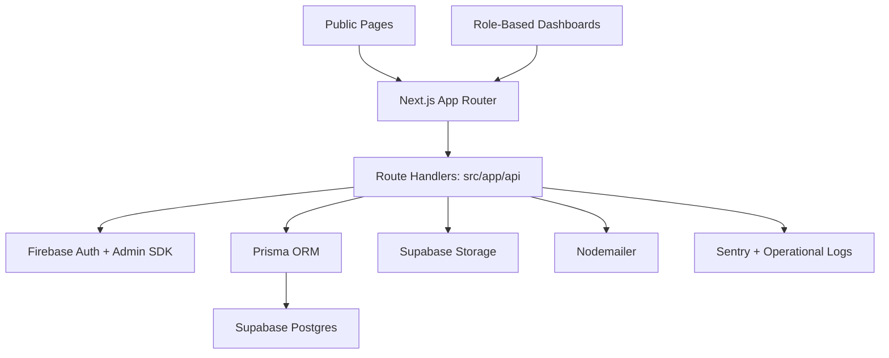

<div align="center">


<br/>


# 🎓 MPhil/PhD Lifecycle Management System

### *Managing the complete postgraduate journey in one platform.*

A full-stack academic workflow platform for handling **applications**, **registrations**, **proposals**, **progress reports**, **theses**, **vivas**, **corrections**, and **administrative review flows** across the full MPhil/PhD lifecycle.

**[📘 Project Overview](./PROJECT_OVERVIEW.md)** · **[🗂️ Project Docs](./docs/)** · **[🖼️ Assets](./images/)** · **[🧪 Tests](./tests/)**

</div>

---

## Table of Contents

- [🎓 MPhil/PhD Lifecycle Management System](#-mphilphd-lifecycle-management-system)
    - [*Managing the complete postgraduate journey in one platform.*](#managing-the-complete-postgraduate-journey-in-one-platform)
  - [Table of Contents](#table-of-contents)
  - [Overview](#overview)
  - [What The System Covers](#what-the-system-covers)
  - [User Roles](#user-roles)
  - [Key Features](#key-features)
    - [For Students](#for-students)
    - [For Supervisors](#for-supervisors)
    - [For Examiners](#for-examiners)
    - [For Administrators](#for-administrators)
  - [Tech Stack](#tech-stack)
  - [Architecture At A Glance](#architecture-at-a-glance)
  - [Quick Start](#quick-start)
    - [Prerequisites](#prerequisites)
    - [Installation](#installation)
    - [Configure Environment Variables](#configure-environment-variables)
    - [Generate Prisma Client](#generate-prisma-client)
    - [Run Database Migrations](#run-database-migrations)
    - [Start Development Server](#start-development-server)
  - [Repository Structure](#repository-structure)
    - [Directory Guide](#directory-guide)
  - [Frontend Structure](#frontend-structure)
    - [Public Pages](#public-pages)
    - [Dashboard Pages](#dashboard-pages)
  - [API Overview](#api-overview)
  - [Core Business Areas](#core-business-areas)
  - [Data And Validation](#data-and-validation)
  - [Environment Variables](#environment-variables)
    - [Database And Storage](#database-and-storage)
    - [Firebase](#firebase)
    - [Email And Session](#email-and-session)
    - [Optional Monitoring](#optional-monitoring)
  - [Testing And Quality](#testing-and-quality)
  - [Best Files To Read First](#best-files-to-read-first)
  - [Documentation](#documentation)
  - [Contributing](#contributing)
  - [Support](#support)
  - [License](#license)

---

## Overview

The **MPhil/PhD Lifecycle Management System** is a role-based academic operations platform built to manage the full postgraduate research journey in one system.

It is not only a student portal. It combines:

- a public-facing admissions portal
- a role-based internal dashboard
- a postgraduate workflow management system
- a document submission and review platform
- an administrative coordination layer for supervisors, examiners, and programme staff

The core idea is to move the postgraduate lifecycle away from fragmented forms, email chains, and disconnected document handling into one secure, role-aware platform with shared validation, workflow tracking, and lifecycle visibility.

---

## What The System Covers

The platform supports the complete postgraduate lifecycle, including:

- public programme applications
- admissions and onboarding
- registration and renewal tracking
- proposal submission and review
- progress report submission and supervisor sign-off
- thesis submission and versioning
- viva scheduling and outcome recording
- correction upload and approval
- final archival and administrative oversight

A typical lifecycle flow is:

1. A public applicant submits an application.
2. Administrators review the application and intake status.
3. Once admitted, the applicant becomes a student in the research lifecycle.
4. The student submits proposals, progress reports, thesis documents, and corrections.
5. Supervisors evaluate and sign off academic work.
6. Examiners and administrators manage viva and thesis workflows.
7. Corrections are submitted, reviewed, and approved.
8. Final records are archived for long-term administrative reference.

---

## User Roles

| Role | Main Responsibilities |
|---|---|
| **Student** | Submit proposals, progress reports, theses, and corrections while tracking academic progress |
| **Supervisor** | Review assigned students, evaluate proposals, sign progress reports, and monitor progress |
| **Examiner** | Access assigned viva workspaces, review examination context, and record examination outcomes |
| **Administrator** | Manage users, applications, assignments, scheduling, final decisions, and archival workflows |

---

## Key Features

### For Students

- Public application and admissions entry flow
- Secure sign-in and dashboard access
- Research proposal submission with version tracking
- Progress report submission
- Thesis submission and revision workflows
- Correction upload and lifecycle status tracking
- Role-specific academic progress dashboard

### For Supervisors

- Assigned student roster and profile access
- Proposal evaluation workflows
- Progress report review and sign-off
- Supervision visibility across assigned postgraduate students

### For Examiners

- Assigned viva workspace
- Viva outcome recording
- Thesis examination context and decision support

### For Administrators

- User creation, filtering, and deactivation
- Application review and intake workflows
- Supervisor and examiner assignment workflows
- Proposal approval and rejection decisions
- Viva scheduling and examination coordination
- Thesis correction approval and archival workflows
- Reporting and operational oversight

---

## Tech Stack

| Layer | Technology |
|---|---|
| **Frontend** | Next.js 14 App Router, React 18, TypeScript |
| **Styling** | Tailwind CSS |
| **Backend** | Next.js Route Handlers |
| **Database** | Supabase Postgres + Prisma ORM |
| **Authentication** | Firebase Auth + Firebase Admin SDK |
| **File Storage** | Supabase Storage |
| **Validation** | Zod |
| **Email** | Nodemailer |
| **Client Data Fetching** | SWR |
| **Monitoring** | Sentry |
| **Testing** | Vitest, Testing Library, Playwright |

---

## Architecture At A Glance

The system combines:

- public pages for admissions entry
- role-based dashboards under `/dashboard`
- Next.js route handlers under `src/app/api`
- Supabase Postgres for relational data
- Prisma for ORM access
- Firebase for authentication and identity verification
- Supabase Storage for document workflows
- Zod for shared validation
- Nodemailer for email delivery
- Sentry and logging support for monitoring and operational follow-up



Alternative layer view:

```text
┌────────────────────────────────────────────────────────────┐
│                       CLIENT LAYER                         │
│         Next.js App Router · React · Tailwind CSS          │
└───────────────────────────┬────────────────────────────────┘
                            │ HTTP / Server Actions / API
┌───────────────────────────▼────────────────────────────────┐
│                    APPLICATION LAYER                       │
│                  Next.js Route Handlers                    │
│                                                            │
│  Auth · Applications · Dashboard · Proposals · Progress    │
│  Reports · Theses · Vivas · Assignments · Notifications    │
└───────────────────────────┬────────────────────────────────┘
                            │ Prisma ORM / SDKs
┌───────────────────────────▼────────────────────────────────┐
│                       SERVICE LAYER                        │
│  Prisma · Firebase Admin · Supabase Storage · Nodemailer   │
└───────────────────────────┬────────────────────────────────┘
                            │
┌───────────────────────────▼────────────────────────────────┐
│                         DATA LAYER                         │
│              Supabase Postgres + Supabase Storage          │
└────────────────────────────────────────────────────────────┘
```

---

## Quick Start

### Prerequisites

Make sure you have the following installed and configured:

- Node.js `18.17.0` or higher
- `npm`
- Supabase project with a Postgres database
- Firebase project credentials
- Supabase project and storage bucket

### Installation

```bash
git clone https://github.com/cepdnaclk/e23-co2060-MPhil-PhD-Lifecycle-Management-System.git
cd e23-co2060-MPhil-PhD-Lifecycle-Management-System
npm install
```

### Configure Environment Variables

Create a local `.env` file in the project root using the variables listed in [Environment Variables](#environment-variables).

### Generate Prisma Client

```bash
npm run prisma:generate
```

### Run Database Migrations

```bash
npm run prisma:migrate
```

### Start Development Server

```bash
npm run dev
```

Open the application at:

```text
http://localhost:3000
```

---

## Repository Structure

```text
e23-co2060-MPhil-PhD-Lifecycle-Management-System/
│
├── src/
│   ├── app/                    # App Router pages, layouts, and API routes
│   ├── components/             # Reusable and domain-specific UI components
│   │   ├── admin/
│   │   ├── application/
│   │   ├── auth/
│   │   ├── dashboard/
│   │   ├── examiner/
│   │   ├── progress-reports/
│   │   ├── proposals/
│   │   ├── student/
│   │   ├── supervisor/
│   │   └── ui/
│   ├── lib/                    # Business logic, integrations, validation
│   └── types/                  # Shared TypeScript types
│
├── prisma/                     # Prisma schema and database setup
├── tests/                      # Unit, integration, and e2e tests
├── docs/                       # Additional project documentation
├── images/                     # Logo and static assets
├── scripts/                    # Helper scripts
├── PROJECT_OVERVIEW.md         # High-level project walkthrough
└── README.md
```

### Directory Guide

- `src/app` — public routes, dashboard routes, layouts, and API route handlers
- `src/components` — reusable and domain-level UI components
- `src/lib` — business logic, validation, integrations, and workflow helpers
- `src/types` — shared TypeScript types
- `prisma` — schema and database definitions
- `tests` — automated test coverage
- `.github` — workflows and repository automation files
- `docs` — extended project documentation
- `images` — logo and README/static assets

---

## Frontend Structure

The application has two main user-facing areas.

### Public Pages

| Route | Purpose |
|---|---|
| `/` | Landing page |
| `/apply` | Public application form |
| `/apply/success` | Application submission success page |
| `/login` | Sign-in page |

### Dashboard Pages

Role-based dashboards live under `/dashboard`, including:

- `/dashboard/student`
- `/dashboard/supervisor`
- `/dashboard/examiner`
- `/dashboard/admin`

The shared dashboard shell is located at:

```text
src/components/dashboard/dashboard-role-layout.tsx
```

This layout controls:

- sidebar navigation
- active route styling
- dashboard framing
- shared typography and page structure

Because all role dashboards flow through this shell, many dashboard-wide UI changes can be applied centrally.

---

## API Overview

Backend logic lives under:

```text
src/app/api
```

This is a full-stack Next.js repository where frontend pages and backend endpoints live in the same codebase.

Main API domains include:

- `auth`
- `applications`
- `admin`
- `assignments`
- `dashboard`
- `documents`
- `notifications`
- `progress-reports`
- `proposals`
- `registrations`
- `review-panels`
- `students`
- `supervisor`
- `theses`
- `vivas`

Representative endpoints:

| Method | Endpoint | Description |
|---|---|---|
| `POST` | `/api/auth/*` | Authentication and session-related flows |
| `POST` | `/api/applications` | Submit a public postgraduate application |
| `GET` | `/api/admin/users` | List and filter platform users |
| `POST` | `/api/proposals` | Submit a student proposal |
| `POST` | `/api/proposals/:id/evaluations` | Submit a proposal evaluation |
| `POST` | `/api/student/progress-reports` | Submit a progress report |
| `POST` | `/api/theses` | Submit a thesis record |
| `POST` | `/api/vivas` | Schedule a viva |
| `POST` | `/api/vivas/:id/outcome` | Record a viva outcome |

> This is a representative overview only. Additional role-specific routes live under `src/app/api`.

---

## Core Business Areas

| Area | Description |
|---|---|
| **Applications** | Public intake, supporting documents, validation, and status transitions |
| **Authentication** | Login, identity verification, role-aware access control, and session handling |
| **Dashboard** | Role-based summaries, KPI cards, quick actions, and dashboard navigation |
| **Proposals** | Submission, version handling, supervisor evaluations, approval, and rejection workflows |
| **Progress Reports** | Recurring student reporting cycles and supervisor sign-off |
| **Theses** | Thesis submission, examiner assignment, corrections, version tracking, and final archival |
| **Vivas** | Scheduling, venue/date management, outcome recording, and post-viva lifecycle transitions |
| **Administration** | User management, assignments, scheduling, finalization, and operational control |
| **Notifications and Monitoring** | Delivery auditing, user-facing notifications, oversight, and logging |

---

## Data And Validation

The database schema is defined in:

```text
prisma/schema.prisma
```

The codebase is centered around a lifecycle-oriented model that includes:

- users
- students
- supervisors
- examiners
- administrators
- applications
- registrations
- research proposals
- evaluation forms
- progress reports
- review panels
- theses
- thesis examiner assignments
- vivas
- correction documents
- documents
- notifications
- notification logs

Validation is handled primarily with **Zod** so that client-side and server-side rules stay aligned across workflows such as:

- login
- public applications
- proposals
- proposal evaluations
- progress reports
- theses
- corrections
- viva scheduling

---

## Environment Variables

Create a `.env` file in the project root with the required values for your environment.

### Database And Storage

```env
DATABASE_URL=
SUPABASE_URL=
SUPABASE_SERVICE_ROLE_KEY=
SUPABASE_STORAGE_BUCKET=
NEXT_PUBLIC_SUPABASE_URL=
NEXT_PUBLIC_SUPABASE_ANON_KEY=
NEXT_PUBLIC_SUPABASE_STORAGE_BUCKET=
```

### Firebase

```env
NEXT_PUBLIC_FIREBASE_API_KEY=
NEXT_PUBLIC_FIREBASE_AUTH_DOMAIN=
NEXT_PUBLIC_FIREBASE_PROJECT_ID=
NEXT_PUBLIC_FIREBASE_STORAGE_BUCKET=
NEXT_PUBLIC_FIREBASE_MESSAGING_SENDER_ID=
NEXT_PUBLIC_FIREBASE_APP_ID=
FIREBASE_PROJECT_ID=
FIREBASE_CLIENT_EMAIL=
FIREBASE_PRIVATE_KEY=
```

### Email And Session

```env
SMTP_HOST=
SMTP_PORT=
SMTP_USER=
SMTP_PASS=
SMTP_FROM=
SESSION_COOKIE_NAME=
SESSION_ACTIVITY_COOKIE_NAME=
APP_BASE_URL=
```

### Optional Monitoring

```env
SENTRY_DSN=
NEXT_PUBLIC_SENTRY_DSN=
SENTRY_ORG=
SENTRY_PROJECT=
SENTRY_AUTH_TOKEN=
```

> Never commit your `.env` file.

---

## Testing And Quality

Run the full test suite:

```bash
npm test
```

Useful test commands:

```bash
npm run test:unit
npm run test:integration
```

Available scripts:

| Command | Purpose |
|---|---|
| `npm run dev` | Start the development server |
| `npm run build` | Generate Prisma client and build the production app |
| `npm run start` | Run the production server |
| `npm run lint` | Run ESLint |
| `npm run prisma:generate` | Generate the Prisma client |
| `npm run prisma:migrate` | Run development migrations |
| `npm test` | Run Vitest |
| `npm run test:unit` | Run unit tests only |
| `npm run test:integration` | Run integration tests only |

Testing coverage is prepared around major project areas, including:

- authentication
- applications
- proposals
- dashboards
- registrations
- progress reports
- theses
- vivas
- storage helpers

---

## Best Files To Read First

If you are new to the repository, start with:

- `README.md`
- `package.json`
- `prisma/schema.prisma`
- `src/app/layout.tsx`
- `src/components/dashboard/dashboard-role-layout.tsx`
- `src/app/api/*`
- `src/lib/applications/*`
- `src/lib/proposals/*`
- `src/lib/theses/*`

These files give the fastest understanding of:

- what the system does
- how the app is structured
- what the major workflows are
- how the data model supports them

---

## Documentation

- `PROJECT_OVERVIEW.md` — deeper workflow and architecture context
- `docs/` — additional project documentation
- `tests/` — test coverage and examples
- `images/` — static assets and README images

---

## Contributing

Contribution workflow is currently not finalized.

Recommended next step: add a `CONTRIBUTING.md` file covering:

- local setup expectations
- coding standards
- branch naming conventions
- commit message style
- testing requirements
- pull request review process

---

## Support

Support channels are currently not finalized.

Recommended next step: add a `SUPPORT.md` file or link the preferred issue, discussion, or contact path here.

---

## License

This project is licensed under the [MIT License](./LICENSE).

---
